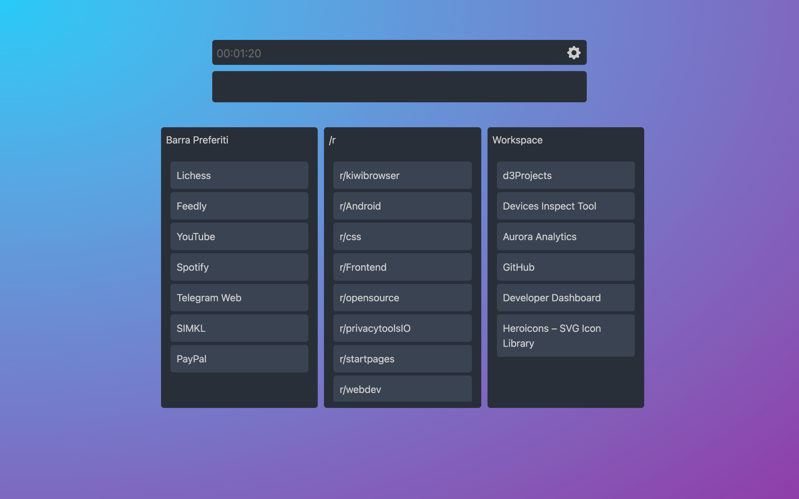

 
	

A simple and powerful New Tab Page with goal of speed and customization.
Bring your favorites in the homepage with a customizable Kanban style

## Preview

## Features

- Powerful search bar that look for your bookmarks or directly search on the web with shortcuts !
- Customizable colors, background and layout
- Sidebar Weather Widget with OpenWeatherMap API
- Sidebar Quick Note Widget

## Installing

- Download latest 'b2ntp.zip' from [Releases](https://github.com/d3ward/b2ntp/releases)
- On your Chromium based Browser go on Extensions page and enable dev mode
- Load the zip file or the unzipped folder
- Enjoy !

## Contributing

If you have a suggestion or want to report a bug feel free to share it by opening an issue

## Other projects & libraries included

- [Tabler Icons](https://tabler.io/icons) [MIT License](https://raw.githubusercontent.com/tabler/tabler-icons/main/LICENSE) | A set of over 5200 free MIT-licensed high-quality SVG icons for you to use in your web projects
- [Heroicons](https://heroicons.dev/) | [MIT License](https://github.com/tailwindlabs/heroicons/blob/master/LICENSE) A set of free high-quality SVG icons
- [Croppie](http://foliotek.github.io/Croppie/) | [MIT License](https://github.com/Foliotek/Croppie/blob/master/LICENSE) A Javascript Image Cropper
- [Vanilla-Picker v2.10.1](https://vanilla-picker.js.org) | [ISC License](https://github.com/Sphinxxxx/vanilla-picker/blob/master/LICENSE.md) A simple, easy to use vanilla JS color picker with alpha selection.

## License

Licensed under [NC-SA-4.0](https://creativecommons.org/licenses/by-nc-sa/4.0/)
Copyright 2024
_**Made with <3 by Eduard Ursu**_